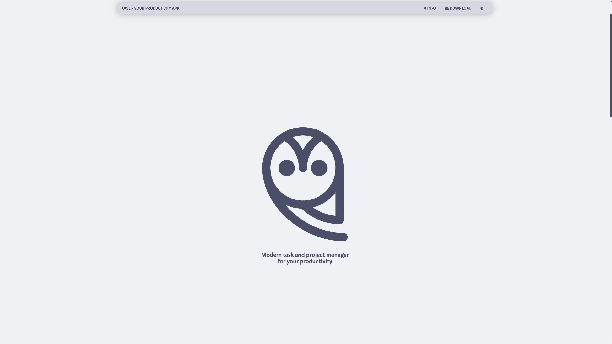
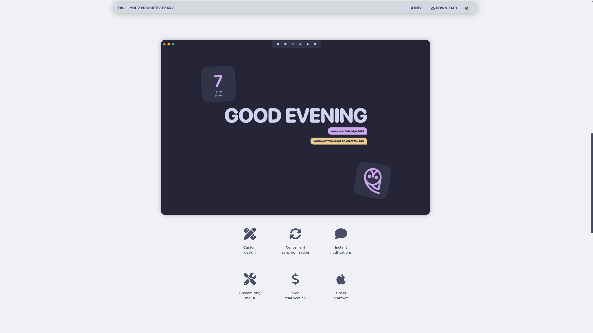

<div align="center">
<h1>OWL PROJECT HOMEPAGE</h1>

<br /><br />




<br /><br />


<br /><br />

</div>

```bash

git clone https://github.com/Nighty3098/owl_website
cd owl_website
yarn
yarn start

```
